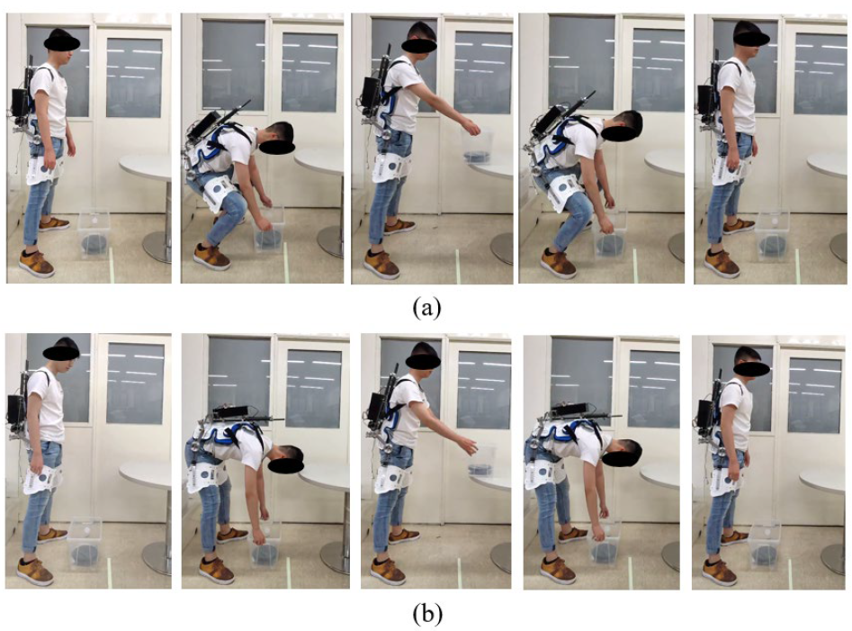

# MonoBearExo
Referenced Paper: http://dx.doi.org/10.13031/aim.202100555

This is the core program runs on RaspberryPi to control my exoskeleton.

Hardware:

- RaspberryPi 3
- GPIO: trigger button for rotation safety
- USB: EPOS4 BLDC motor controller
- USB: HiPNUC 6-axis IMU

Software:

- libsvm for C++
- HiPNUC IMU serial lib for C++
- EPOS lib for C++
- Qt C++ 5.9.9

Before building this project, please install "EPOS_Linux_Library" first.

